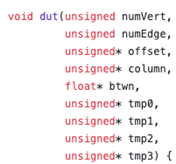

## Repository Tree
```
.
├── test.cpp      //源码框架
├── top.hpp       //头文件
├── top.cpp       //测试源码
├── data          //标准输入
├── run_hls.tcl   //tcl文件
└── README.md     //说明文件
```

## Betweenness （最近一次更新：4月30日）
1. 框架代码说明

    框架代码是算法的C-model，
    您需要自行设计可综合co-sim的设计。  
    但请注意：**您必须保持顶层函数不变。**
    
2. 项目要求  
    
  
  
    •numVert: how many Vertices in the graph
  
    •NumEdge: how many edges om the graph
  
    •Offset: offset of the csr graph
  
    •Column: column of the csr graph
  
    •Btwn: the output betweenness for each vertex
    
    

    
  
3. 提交程序
  
    您仅需提交cpp文件和h文件。
    请将除test.cpp以外的所有cpp和h文件
    压缩为一个压缩包betweenness.zip，
    在页面下方您的解答处点击“**上传代码**”按钮进行提交，
    稍待片刻即可在文本框下方得知您的设计是否通过了基本功能测试。
    延迟、面积等性能指标则可在历史提交记录中点击版本号详细查看。
  
4. 评分规则
  
    将所有的点按照选手计算的betweenness的值从大到小排序
  
    将所有的点按照参考代码计算的betweenness的值从小到大排序
  
    比较上述两个序列从第几个值开始不一样，这个值记为cnt
  
    同时记录程序运行时间 time
    
    小测试用例占40%分数，大测试用例占60%分数，最终得分按小测试用例得分与大测试用例得分加权相加而得
  
    最终得分 mark=[0.6*(cntbig^4)+0.4*(cntsmall^4)]/time，mark越大对应排名得分越高，若程序运行时间超过1个小时则不计分

5 输出信息参考
   
    csim:

    ...
    f936ed83 Top 3534 vertices are the same with golden.
    ...
    f936ed83 Top 1015 vertices are the same with golden.

    
    cosim:
    ...
    f936ed83 Top 0 vertices are the same with golden.
    ...
    f936ed83 Top 0 vertices are the same with golden.

syn和cosim阶段，需要添加自行编写的可综合hls代码。(本示例中的top.cpp的可综合部分（line99~line101)仅提供接口模板，请参考line42~line97的非可综合c-model部分给出解答)

    