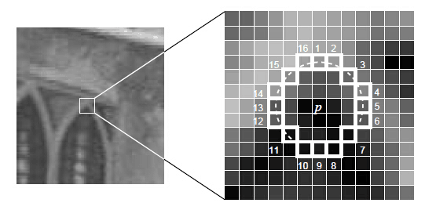

## Repository Tree
```
.
├── fast.cpp         //源码框架
├── fast.h           //头文件
├── fast_test.cpp    //测试源码
├── src.txt          //测试输入
├── dst.txt          //标准输出
├── tcl_script.tcl   //tcl文件
└── README.md        //说明文件
```
## fast

  1）	框架代码说明
  >框架代码是算法的C-model，您需要自行设计可综合co-sim的设计。  
  >但请注意：**您必须保持顶层函数不变。**

  2）项目要求  
  
  >在本项目中，输入的图像已经被转化为了一个大小为128*128的1D array src。输入矩阵是按行展开的。输出矩阵是算法得到的k个特征点在图像中的位置。如果该位置是特征点，则该位置的值为255；如果不是，则该位置的值为0。
  
  >例如，算法得到的一张4*4大小图像的特征点坐标为（0,1）和（2,3），那么dst会分16行输出：0 255 0 0 0 0 0 0 0 0 255 0 0 0 0 0
  
  >关于fast算法本身，threshold取20，判断条件为严格大于threshold，不做padding以及极大值抑制。对于除图像边缘外的每一个像素，先判断该像素的上下左右的1号、5号、9号、13号这四个像素与该像素的像素差是否严格大于阈值，如果有三个及以上的像素大于阈值，则继续计算周围16个点与该像素的像素差（如下图所示），若它们有至少12个超过阈值，则是特征点。
  
  
  
  >在设计完成后，您可以使用我们提供的fast_test.cpp文件进行基本功能测试。但是，由于在评分时会统一使用评分系统内部的fast.h和fast_test.cpp，因此请不要将设计写在fast.h和fast_test.cpp中，fast.h和fast_test.cpp文件也无需提交。如果您有修改头文件的需求，您可以在设计中添加文件名不为fast.h的头文件。
  
  >**在HLS优化的过程中，请务必将优化指令设置为pragma写入c++代码中。**
  
  >比赛不需要生成最终bit文件，仅考察算法实现功能和综合报告的性能，能完成co-sim即可。
	
  3）提交程序
  >您仅需提交cpp文件和h文件。请将除fast.h和fast_test.cpp以外的所有cpp和h文件压缩为一个压缩包fast.zip，在页面下方您的解答处点击“上传代码”按钮进行提交，稍待片刻即可在文本框下方得知您的设计是否通过了基本功能测试。延迟、面积等性能指标则可在历史提交记录中点击版本号详细查看。
  
  4）评分规则
  >性能公式为：<br>
  >如果最大频率小于100MHz，视为未通过基本功能<br>
  >如果最大频率大于等于100MHz，但小于300MHz，使用公式**clock period*fmax/RTL simulation time**计算性能<br>
  >如果最大频率大于等于300MHz，使用公式**clock period*300MHz/RTL simulation time**计算性能<br>
  >其中RTL simulation time是Vitis HLS软件Cosimulation所用时间，clock period是tcl中设定的时钟频率，fmax是设计的最高运行频率。
  >性能公式计算出的数值越大，性能越好。
  >
  >注意：设计的频率范围建议在100MHz和300MHz之间。如果频率低于100MHz，则未能满足最低性能指标，无法得到基本分10分；如果设计的最高运行频率高于300MHz，则在上方公式中也只会取300MHz作为最高频率。
